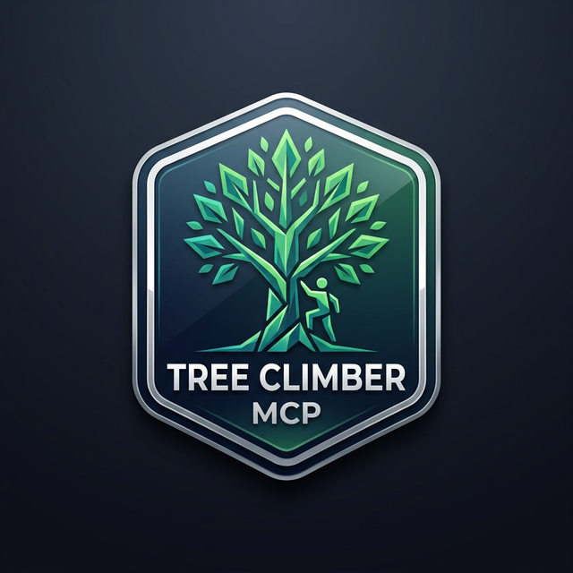

<p align="center">
  
</p>

<h1 align="center">Tree Climber MCP</h1>

<p align="center">
  <b>Safely connect AI models to a local shell environment.</b><br/>
  <sub>xonsh-powered &bull; Secure command execution &bull; MCP compliant</sub>
</p>

<p align="center">
  
  
  
</p>

## About

Tree Climber MCP is a Model Context Protocol (MCP) server that lets AI models interact with a local `xonsh` shell and a small set of filesystem helpers. Shell commands are filtered through a blocklist, and filesystem operations are limited to the shell's current working directory tree by default.

## Features

- **MCP Compliant:** Implements the Model Context Protocol to seamlessly integrate with MCP clients (like Claude Desktop or other AI agents).
- **Safe Shell Execution:** Uses `xonsh` (a Python-powered shell) for command execution.
- **Filesystem Helpers:** Exposes `read_file`, `write_file`, and `list_directory` alongside the shell tool.
- **Security First:** Blocks dangerous shell commands (for example `rm -rf /`, `sudo bash`, and `curl ... | bash`) and restricts filesystem access to the active working directory unless you explicitly opt into a broader scope.
- **Async Server Interface:** Uses `asyncio` for MCP request handling and lifecycle management.
- **Extensive Testing:** Includes a comprehensive unit test suite ensuring reliability and safety.

## Prerequisites

- **Python 3.12+**
- **uv**: Recommended for dependency management.
- `uv sync` installs the Python dependencies, including `xonsh`, into the project environment.

## Installation & Setup

1.  **Clone the repository:**
    ```bash
    git clone https://github.com/crybo-rybo/tree-climber-mcp.git
    cd tree-climber-mcp
    ```

2.  **Install dependencies:**
    This project uses `uv` for package management.
    ```bash
    uv sync
    ```

## Usage

### Running the Server

The server typically runs as a subprocess communicating via `stdio`. To start it manually (e.g., for debugging):

```bash
uv run tree-climber-mcp
```

Optional filesystem scope flags:

- `uv run tree-climber-mcp --filesystem-root /some/folder`: keep filesystem protections enabled, but use `/some/folder` as the trusted root instead of the shell's working directory.
- `uv run tree-climber-mcp --allow-all-paths`: disable filesystem path restrictions entirely for `read_file`, `write_file`, and `list_directory`.

`--allow-all-paths` and `--filesystem-root` are mutually exclusive.

### Integrating with MCP Clients

To use this with an MCP client (like Claude Desktop), configure your client to run the server command from the repository directory.

**Example `claude_desktop_config.json`:**

```json
{
  "mcpServers": {
    "tree-climber": {
      "command": "/path/to/uv",
      "args": [
        "run",
        "--directory",
        "/absolute/path/to/tree-climber-mcp",
        "tree-climber-mcp"
      ]
    }
  }
}
```

To broaden filesystem access in Claude Desktop, add one of the new flags to the `args` array:

```json
{
  "mcpServers": {
    "tree-climber": {
      "command": "/path/to/uv",
      "args": [
        "run",
        "--directory",
        "/absolute/path/to/tree-climber-mcp",
        "tree-climber-mcp",
        "--filesystem-root",
        "/absolute/path/to/workspace"
      ]
    }
  }
}
```

### What "Current Working Directory" Means

By default, the filesystem tools trust the current working directory of the MCP server process. In practice, for Claude Desktop, that is the directory implied by how the server command is launched.

- If you use `uv run --directory /absolute/path/to/tree-climber-mcp tree-climber-mcp`, the default trusted root will be `/absolute/path/to/tree-climber-mcp`.
- If you want a different root, pass `--filesystem-root /absolute/path/to/workspace`.
- If you want no filesystem containment checks at all, pass `--allow-all-paths`.

## Security

Tree Climber MCP applies two safety layers:

- Shell commands are checked against the regex list in `src/tree_climber_mcp/security.py`.
- Filesystem tools operate inside the shell's current working directory tree by default.
- `--filesystem-root PATH` keeps the same protections but changes the trusted root to `PATH`.
- `--allow-all-paths` disables filesystem path containment checks entirely.

Blocked shell categories include:

- **System Destruction:** `rm -rf /`, formatting disks.
- **Privilege Escalation:** `sudo bash`, system shutdown commands.
- **Remote Code Execution:** `curl | bash`, `wget | sh`.
- **Resource Exhaustion / Scanning:** Fork bombs, `masscan`, `nmap`.

**Note:** While significant safeguards are in place, always proceed with caution when granting an AI agent access to your terminal.

## Development

### Running Tests

This project uses `pytest` for unit testing. The test suite covers command validation, shell interaction, and server logic.

```bash
PYTHONPATH=src uv run pytest
```

### Project Structure

- `src/tree_climber_mcp/__main__.py`: CLI entrypoint used by `uv run tree-climber-mcp`.
- `src/tree_climber_mcp/server.py`: registers the shell and filesystem tools with the MCP server.
- `src/tree_climber_mcp/tools/command.py`: validates and runs shell commands.
- `src/tree_climber_mcp/tools/filesystem.py`: implements `list_directory`, `read_file`, and `write_file`.
- `src/tree_climber_mcp/shell.py`: manages the persistent `xonsh` subprocess.
- `src/tree_climber_mcp/config.py` and `src/tree_climber_mcp/security.py`: runtime config and blocked-command definitions.
- `tests/`: pytest coverage mirroring the package layout.
